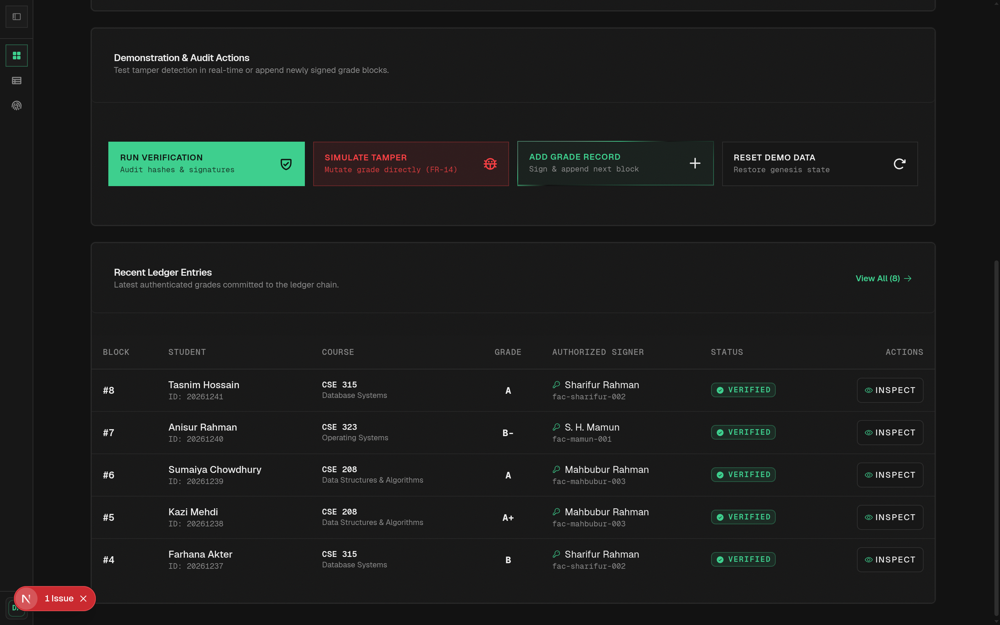
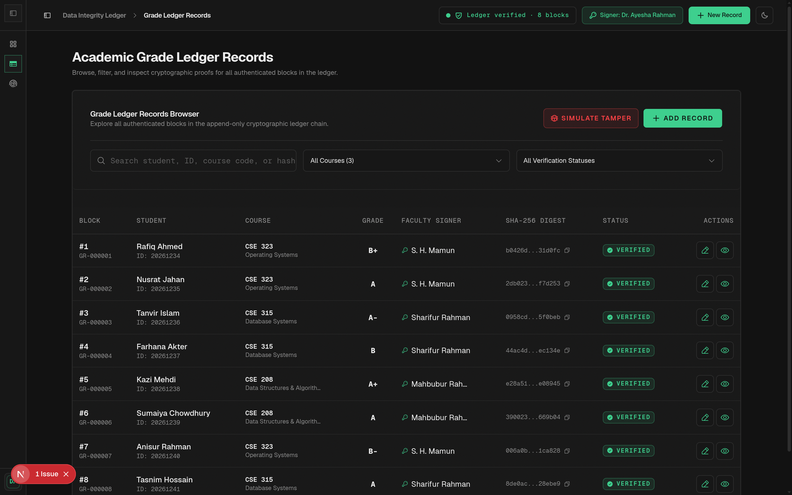
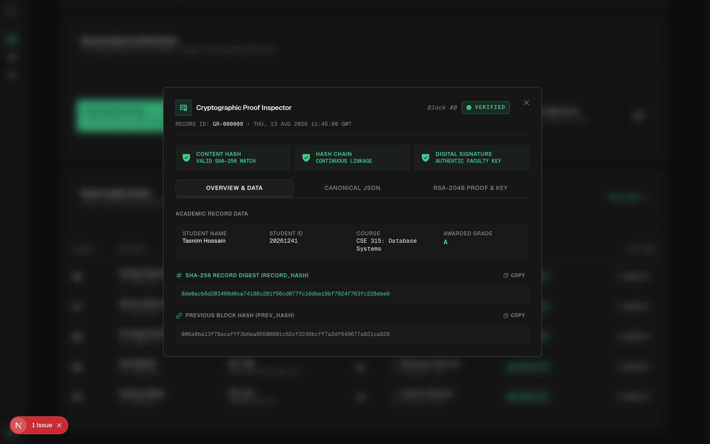
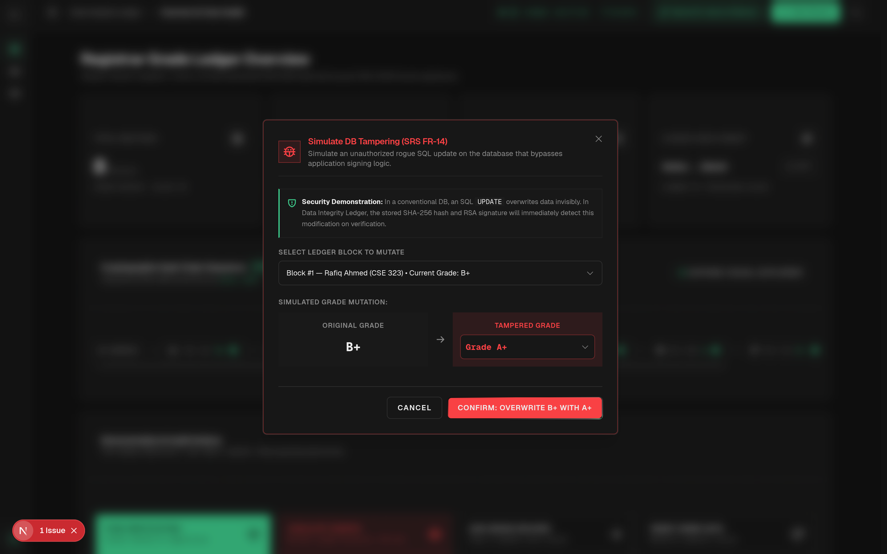
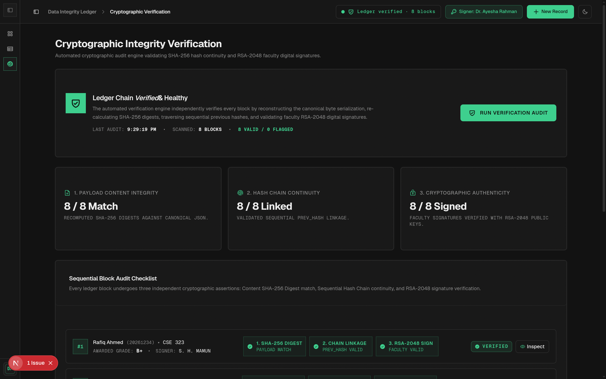
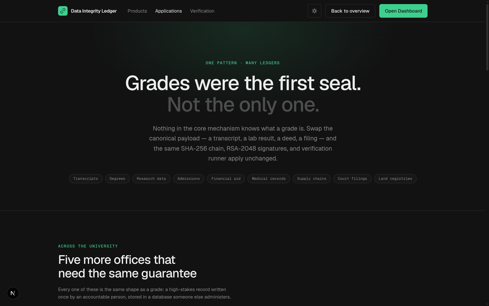
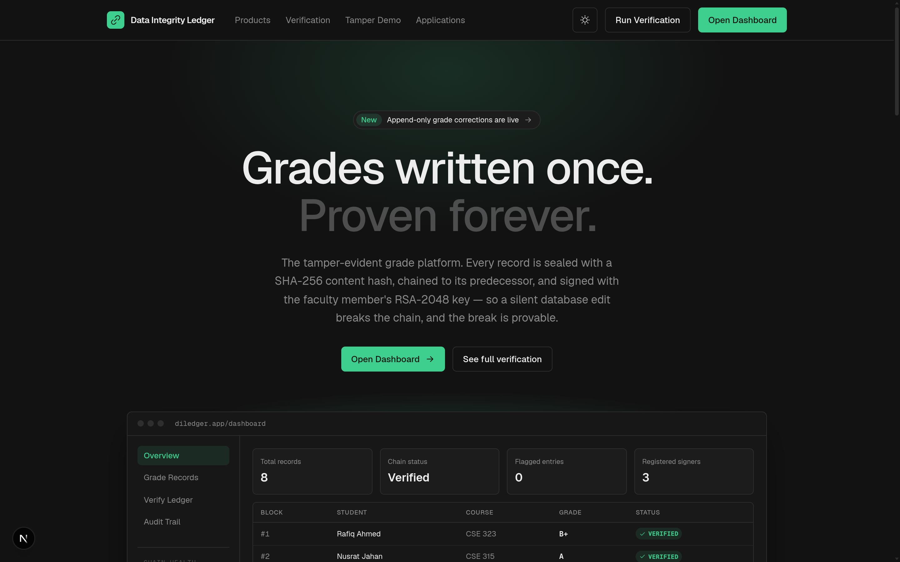
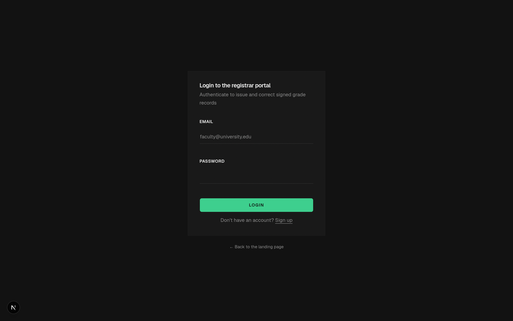

# Data Integrity Ledger

> **Tampering may not be preventable, but unauthorized modification must become detectable and provable.**

**Data Integrity Ledger** is a tamper-evident grade and academic records management system built with Next.js 16 App Router, TypeScript, Tailwind CSS, and standard Node.js cryptography (`node:crypto`).

Traditional databases ask: *"Was this user authorized to modify the row?"*  
The Data Integrity Ledger additionally asks: ***"Does the current database record still match the cryptographically authenticated record?"***



---

## Key Features

- **Deterministic Canonical Serialization**: RFC 8785-compliant deterministic payload ordering ensuring identical byte serialization across systems.
- **SHA-256 Content Hashing**: Every record contains an immutable content hash of its canonical payload.
- **Sequential Hash Chaining**: Each ledger entry cryptographically references the previous block's hash (`prev_hash` → `record_hash`), creating an unbroken tamper-evident sequence.
- **RSA-2048 Digital Signatures**: Every record is signed with the faculty signer's RSA-2048 private key; signatures are verifiable using public keys.
- **Real-Time Verification Engine**: Multi-stage cryptographic audit pipeline that validates record content hashes, digital signatures, and chain continuity.
- **Controlled Tampering Simulation**: Live demonstration portal to simulate direct database-level tampering and observe immediate detection.
- **Registrar Portal UI**: Clean, academic-inspired interface designed with shadcn/ui, warm surfaces, dark forest navigation, and accessible VERIFIED / FLAGGED status indicators.
- **Cloudflare Workers Ready**: Configured for edge deployment on Cloudflare Workers using OpenNext with `nodejs_compat` support.

---

## UI Showcase

### 1. Registrar Dashboard & Chain Health
The centralized command center for monitoring the ledger sequence, chain height, verified blocks, and recent grade submissions.


---

### 2. Real-Time Cryptographic Verification Engine
An automated three-stage audit scanner that independently reconstructs canonical payloads, recalculates SHA-256 digests, verifies `prev_hash` chain linkage, and validates RSA-2048 signatures.


---

### 3. Grade Records Browser & Audit Trail
Search, filter, and inspect immutable grade blocks with signer attributions and block indices.



---

### 4. Cryptographic Proof Inspector
Inspect the canonical JSON payload, stored vs computed SHA-256 hash digests, and RSA-2048 faculty signature verification for any block.



---

### 5. Tamper Simulation & Detection
Simulate unauthorized direct database updates (bypassing application logic) and observe immediate tamper alerts and broken chain detection across the entire ledger.

| Tamper Alert on Dashboard | Verification Breakdown with Flagged Violation |
| :---: | :---: |
|  |  |

---

### 6. Applications Beyond Grades
Explore how the same SHA-256 hash chaining and RSA signature architecture applies to transcripts & degrees, clinical research data, medical records, supply chains, and land registries.



---

### 7. Landing Page & Faculty Authentication
Modern landing page and faculty portal with automated RSA-2048 keypair generation and credential provisioning.

| Landing Page | Faculty Login & Key Provisioning |
| :---: | :---: |
|  |  |

---

## Tech Stack

- **Framework**: Next.js 16 (App Router, Turbopack)
- **Runtime & Package Manager**: **Bun**
- **Language**: TypeScript 5 (Strict Mode)
- **Styling**: Tailwind CSS v4
- **UI Primitives**: shadcn/ui (`base-sera` style, `@base-ui/react`, `@phosphor-icons/react`)
- **Cryptography**: Standard `node:crypto` (SHA-256, RSA-2048 PKCS#1 v1.5 with SHA-256)
- **Database & ORM**: PostgreSQL / Supabase with Prisma ORM
- **Deployment**: Cloudflare Workers (`@opennextjs/cloudflare` + `wrangler`)

---

## Getting Started

### Prerequisites

- [Bun](https://bun.sh) (v1.1+)

### Installation

```bash
# Clone the repository
git clone https://github.com/itshimelz/DataIntegrityLedger.git
cd DataIntegrityLedger

# Install dependencies
bun install
```

### Development

```bash
# Start local development server
bun dev
```

Visit `http://localhost:3000` to access the portal.

### Testing & Verification

```bash
# Run unit & integration test suites
bun test

# Run Oxlint linter
bun run lint

# Run TypeScript type check
bun run typecheck
```

---

## Deployment to Cloudflare Workers

The project is configured for edge execution on Cloudflare Workers with Node.js compatibility enabled.

```bash
# 1. Build and preview locally on Cloudflare workerd runtime
bun run preview

# 2. Deploy to Cloudflare Workers
bun run deploy
```

---

## License

MIT
